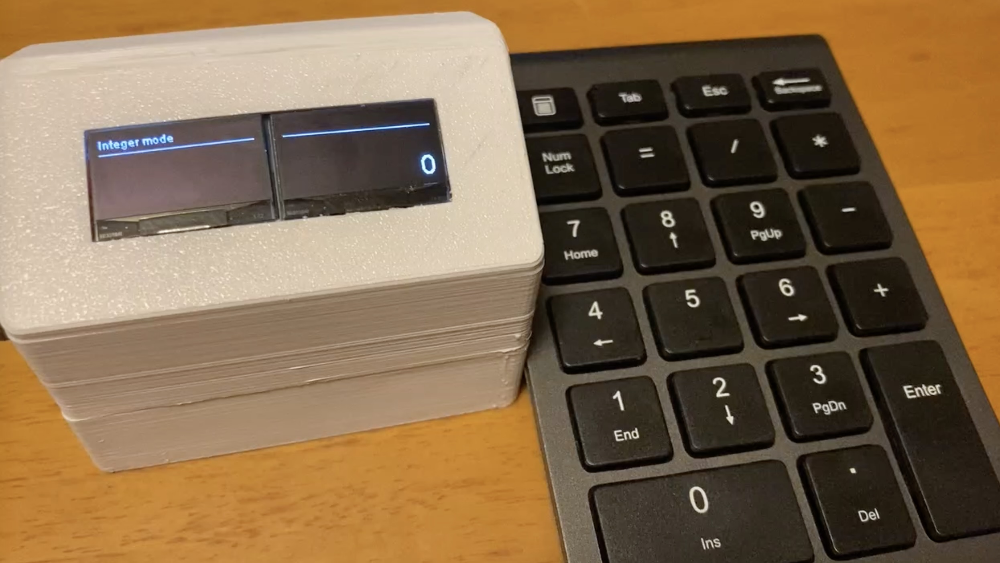

# RPN-Calculator-USB-Keyboard-Version
RPN(逆ポーランド記法）電卓のUSBキーボード版です。Arduino IDE 環境で開発しており、マイコンESP32で動作します。

RPN（逆ポーランド記法）の関数電卓が欲しくなって、マイコン(ESP32)で作り始めた電卓です。
まずは整数演算からということで、最初は整数用16桁の電卓を作りました。
内部データはBCD（２進化10進数）で持っており、RPNの特徴であるスタックは連結リストで実現しているため、メモリが不足するまで追加できます。四則演算は筆算のアルゴリズムで完全スクラッチしています。
BCDにしたのは丸め誤差が出ないことと、有効桁数を自由に設計出来るので選択しました。

次に整数電卓に実数モードを追加しました。
有効桁数16桁の浮動小数点演算です。整数演算のロジックを実数用に拡張して実数の四則演算が出来るようにしました。
続いて三角関数の実装ですが、三角関数ははCORDICアルゴリズムで実装しました。自作の実数の四則演算を使って計算しています。三角関数はラジアンではなく度の入力にしました。

逆三角関数ですが、テーラー展開で実装しています。
この計算機のRPN電卓の特徴であるスタックをフル活用しようと、逆三角関数を計算するときにスレッドを生成し、そのスレッドでキー操作されたように見せかけて計算しています。具体的には、逆三角関数計算スレッドが”＊”や”＋”等の演算子、”Enter"を押下したように見せかけて、内部メモリ（スタック）を使った計算をするスクリプトのようにプログラムしています。
逆三角関数計算スレッドが電卓を操作しているようになるので、計算途中には表示画面がチラチラ書き変わって行くのも面白いなと思っています。

また、テンキーは市販の好きなUSBテンキーを使えるようにと思い、USB接続をし、内部で持つキーマトリクスでキーボードの違いを吸収しています。

## ハードウェア構成
[ESP32 DevKitC 1個](https://www.amazon.co.jp/dp/B06XWP81GP?ref_=ppx_hzsearch_conn_dt_b_fed_asin_title_4)

[0.96インチ OLEDディスプレイ 2個](https://www.amazon.co.jp/dp/B08MZGX7YR?ref_=ppx_hzsearch_conn_dt_b_fed_asin_title_1)

[ミニUSBホストシールド2.0](https://www.amazon.co.jp/dp/B074HTPK13?ref_=ppx_hzsearch_conn_dt_b_fed_asin_title_8)

[マイクロSDストレージ拡張ボード](https://www.amazon.co.jp/dp/B07MB9TS13?ref_=ppx_hzsearch_conn_dt_b_fed_asin_title_2) *SDカードにキーマトリクスを持たせる場合に必要

電源周りはご自由に。
USB給電であればそのまま。持ち運びのためにバッテリー駆動するならそれらの部品と回路

USBキーボードは好みのものを選んでください。

## 配線
- GPIO
    -　5          USB SS
    - 15          SD CS
    - 17          USB INT
    - 18          SPI CLK
    - 19          SPI MISO
    - 21          I2C SDA (OLED)
    - 22          I2C SCL (OLED)
    - 23          SPI MOSI
    - 5V          V-BUS
    - EN          USB RST  

- OLED i2c アドレス
    - OLED_I2C_ADDRESS 1 0x3d　（裏面のチップ抵抗の位置をずらしてください）
    - OLED_I2C_ADDRESS 2 0x3c

## 必要ライブラリー
  ESP8266_and_ESP32_OLED_driver_for_SSD1306_displays  
  USB_Host_Shield_Library_2.0  

